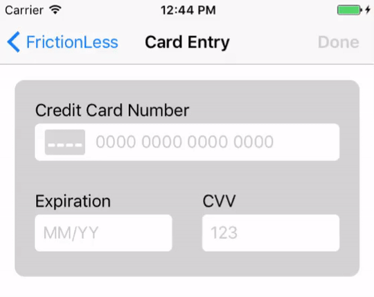

# Card Entry
A drop-in, customizable card entry widget.



# Usage
See [CardEntryExampleViewController](/CardEntryExampleViewController.swift) in the example project.

To implement, add the `CardEntryViewController` as a child to your `UIViewController`:
```swift
// in some view controller

let cardVC = CardEntryViewController()
cardVC.delegate = self
view.addSubview(cardVC.view)
addChildViewController(cardVC)
cardVC.didMove(toParentViewController: self)
```
### CardEntryViewControllderDelegate
Assign the delegate to receive validity callbacks:
```swift
func cardEntryViewController(_ vc: CardEntryViewController, creditCardValid: Bool)
```
### Configuration
Leverage `UIAppearance` or instance properties to tweak styling.
```swift
CardEntryView.appearance().cornerRadius = 5
CardEntryView.appearance().backgroundColor = .lighGray
CardEntryView.layoutMargins = UIEdgeInsets(top: 10, left: 50, bottom: 10, right: 10)

FormattableTextField.appearance().font = UIFont.preferredFont(forTextStyle: .body)
FormattableTextField.appearance().textColor = .darkText

FrictionLessFormComponent.appearance().titleToTextFieldPadding = 3
FrictionLessFormComponent.appearance().textFieldToValidationPadding = 2

FrictionLessFormValidationLabel.appearance().textColor = .red
```
