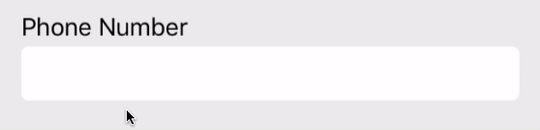
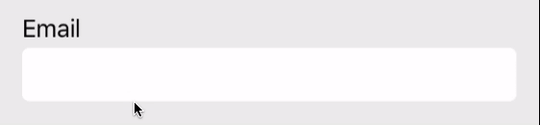

# FormattableTextField
A UX-focused textfield formatter/validator built for bulletproof as-you-type formatting.

## Features
- Built for as-you-type formatting
- Build your own bullet-proof formatters
- Cursor position is correct through input, delete, cut, and paste
- Delete across formatting characters
- Support for auto-advancing for complete textfields
- Support for interpreting backspace in an empty textfield as navigation to previous field
- Support for overflowing input from the end of a complete textfield to the next field






## Usage
Create a `FormattableTextField` and assign it a `TextFieldFormatter` conforming formatter
```swift
let phoneNumberTextField: FormattableTextField = {
   let textField = FormattableTextField()
   textField.formatter = PhoneFormatter()
   textField.keyboardType = .phonePad
   return textField
}()
```

### FormattableTextFieldDelegate
Assign the `textField.delegate` and implment any of the following methods to make experience decisions based on input.
```swift
public protocol FormattableTextFieldDelegate: UITextFieldDelegate {
    func textFieldShouldNavigateBackwards(_ textField: FormattableTextField)
    func textField(_ textField: FormattableTextField, didOverflowInput string: String)
    func textField(_ textField: FormattableTextField, invalidInput error: Error)
    func editingChanged(textField: FormattableTextField)
}
```

### Creating A Formatter
Implement the `TextFieldFormatter` protocol to build your own formatter.
```swift
// A formatter to add spaces in between numbers
struct MyFormatter: TextFieldFormatter {
  var inputCharacterSet = CharacterSet.decimalDigits
  var formattingCharacterSet = CharacterSet(charactersIn: " ")
  
  func format(editingEvent: EditingEvent) -> FormattingResult {
      let formattedString = editingEvent.newValue.characters.map({String($0)}).joined(separator: " ")
      return .valid(.text(formattedString))
  }
}
```

